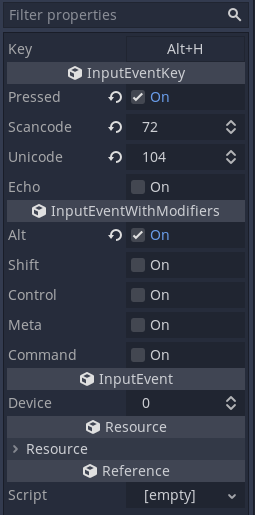
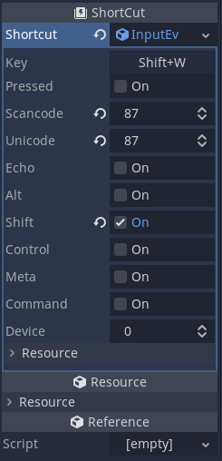

# InputEventKey Grabber
A button that grabs key events and populate an InputEventKey instance for [Godot](https://godotengine.org/).

Comes with a property editor for easy setup of InputEventKey Resources in editor,
great for creating ShortCut resources.

## [Installing](https://docs.godotengine.org/en/stable/tutorials/plugins/editor/installing_plugins.html)
Copy the [addons/input_event_key_grabber](addons/input_event_key_grabber)
folder into your project or import it from [Godot Asset Library](https://godotengine.org/asset-library/asset/946).

Alternatively, if you don't need the editor plugin, just copy the
[addons/input_event_key_grabber/input_event_key_grabber_button.gd](addons/input_event_key_grabber/input_event_key_grabber_button.gd)
file into your project.

## API
### **InputEventKeyGrabberButton** ([addons/input_event_key_grabber/input_event_key_grabber_button.gd](addons/input_event_key_grabber/input_event_key_grabber_button.gd))

`signal event_updated(event: InputEventKey)`
- Emitted when a new key is set either by user input or when setting `event` property.

`export(String) var press_key_text = "Press key combo..."`
- Text shown when key grabber is focused, hinting it is grabbing keys.

`export(bool) var auto_release_focus = true`
- If true, key grabber gives up focus when a key that is not a modifier
  (control, alt, shift, meta, command) is pressed.
  If its [focus_next](https://docs.godotengine.org/en/stable/classes/class_control.html#class-control-property-focus-next)
  points to another Control, focus will be passed on to it, otherwise
  it just releases focus.

`var event: InputEventKey`
- InputEventKey property, changes every time user inputs a new key combo.
  Setting it manually updates the shown text.
